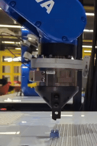
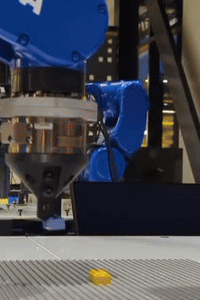

# Robotic_Lego_Manipulation

This repo includes Lego manipulation using Fanuc and Yaskawa robots.


## Instructions
1. Modify the configuration file `path_to_repo/config/user_config.json`.
2. Download the controller at [ST Motion Controller](https://github.com/intelligent-control-lab/Stream_Motion_Controller) and the digital twin at [Robot Digital Twin](https://github.com/intelligent-control-lab/Robot_Digital_Twin).
3. Follow the instructions to launch the controller and digital twin (if needed).
4. Launch the manipulation node:
```
roslaunch lego_manipulation lego_manipulation_node.launch
```

## Robot Manipulation Skills
<div style="display: flex; justify-content: space-between; text-align: center;">
  <figure style="text-align: center; margin-right: 10px;">
    
    <figcaption>Transit a brick</figcaption>
  </figure>

  <figure style="margin-right: 100px;">
    
    <figcaption>Pick/Disassemble</figcaption>
  </figure>

  <figure style="margin-right: 100px;">
    
    <figcaption>Place/Assemble</figcaption>
  </figure>

  <figure>
    
    <figcaption>Support</figcaption>
  </figure>
</div>


## Robotic Lego Assembly in Motion
<div style="display: flex;  text-align: center; flex-wrap: nowrap;">
  <figure style="margin-right: 100px;">
    
    <figcaption>Surprise on Valentine's Day</figcaption>
  </figure>

  <figure style="margin-right: 100px;">
    
    <figcaption>Multi-Robot Collaboration</figcaption>
  </figure>

  <figure style="margin-right: 100px;">
    
    <figcaption>Build More!</figcaption>
  </figure>

</div>

## Citation
If you find this repository helpful, please kindly cite our work.
```
@article{liu2023lightweight,
  title={A Lightweight and Transferable Design for Robust LEGO Manipulation},
  author={Liu, Ruixuan and Sun, Yifan and Liu, Changliu},
  journal={arXiv preprint arXiv:2309.02354},
  year={2023}
}
```

## License
This project is licensed under the MIT License.
